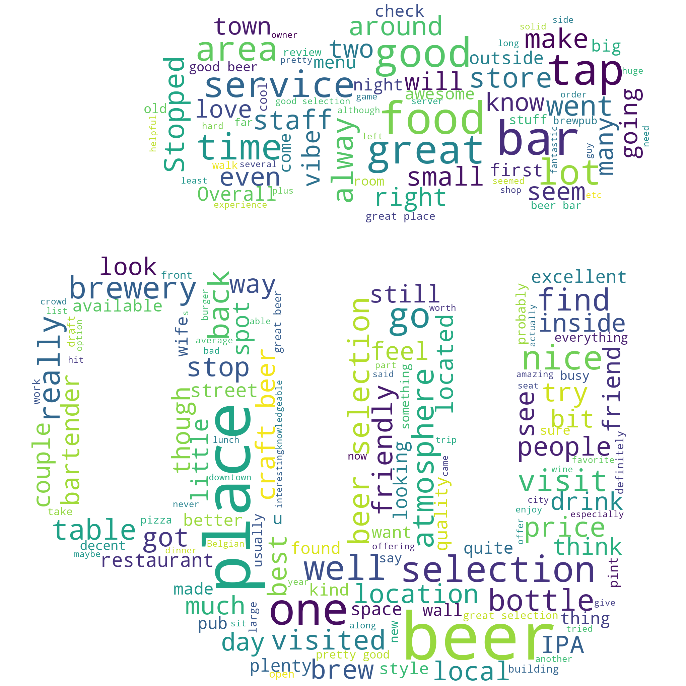

# Brewery Review NLP Project

## Final Capstone Project for Springboard Data Science Career Track (March 2020 Cohort)

## Problem Statement

For review collection companies such as Google Places, Yelp, and TripAdvisor, it's useful to summarize reviews into short descriptive sentences or phrases. For example, from Google Maps, “From scratch, Northern Italian dining.”

**How can we generate short descriptions of breweries using brewery reviews?**

For example, "Spacious warehouse brewery with daily food trucks. Allows dogs. Features IPAs, Hazy IPAs, and high-gravity stouts."

### Scope

While the problem statement includes "generating short descriptions," the main purpose of this project report is training and evaluating an NLP model. We will address generating short descriptions in a future article.

#### Why Breweries?

The scope of this project is limited to breweries mainly to keep annotation simple. For example, while "hazy" is a desired feature for beer, it does not generalize for all businesses or domains.

Additionally, beer and breweries are familiar domains for the researcher, who is the maintainer of the open-source project, [Open Brewery DB](https://www.openbrewerydb.org/).

### Problem Breakdown

An extremely naive and inefficient approach could to be for a human to manually read through each review and come up with a sentence.

Another less naive but still inefficient approach could be to manually search for and find select words we want to highlight. Reading through a dozen or so reviews and you can quickly pick out common "valuable" words such as "selection," "spacious," "IPA," and many more.

However, even if we do determine the word frequency of all of the brewery reviews, there are surely more words we might leave out.

This is where Natural Language Processing (NLP) will help us.

### Using NLP

We can use Named Entity Recognition to mark words and phrases so that we can collect and use them to construct descriptive sentences.

We will be using [spaCy](https://spacy.io/) and transfer learning to update the named entity recognizer model.

## Data Wrangling

While there are some datasets available from review sites, the scope of this project revolves around breweries, bottle shops, brewpubs, and "craft beer" bars. In order to maintain control over the data collection, it was determined scraping from a public website was the most reasonable course of action and would collect enough data for model training.

### Source - Beer Advocate

For this project, the beer review website [Beer Advocate](https://www.beeradvocate.com) (BA) was chosen to scrape.

Other public resources were considered such as Yelp and Google Places, but neither provided the kind of information required for this particular project. They also both had restrictions on  what kind of data you could pull via their API. A final prohibative measure is that they are Javascripts apps, which limits scraping techniques and increases development time.

### Scraping Guidelines

Following a few guidelines in order to not overwhelm the BA website resources:

* Programmed a 1 second delay between requests,
* Performed requests during off-hours
* Added a custom User-Agent in case the administrator needed to contact me
* Only scraped data I needed
* Verified there was no available API to use

### Method

1. Gather cities
2. For each city gather breweries
3. For each brewery gather reviews
4. Save Cities, Breweries, and Reviews into a DB

All of the data was saved in a SQLite3 database.

#### DB Model Schema

* **Cities**
  * id (Integer)
  * name (String)
  * url (String)
  * ba_city_id (Integer)
* **Breweries**
  * id (Integer)
  * name (String)
  * street (String)
  * city_id (Integer)
  * url (String)
  * ba_brewery_id (Integer)
* **Reviews**
  * id (Integer)
  * text (Text)
  * date (Datetime)
  * rating (Float)
  * ba_brewery_id (Integer)

### Results

* 86 cities
* 4,984 breweries
* 45,417 reviews

### Lessons Learned

* It took ~5 hours to scrape ~5000 breweries. Each scrape took ~2 seconds with the delay. I completed the scrape between 12-14-2020 21:00 PST and 12-15-2020 04:00 PST.
* Using SQLite and SQLAlchemy was a good learning experience. But, a document-oriented database (document store), like MongoDB or AWS DynamoDB would have served the same purpose and easier to implement.

## Exploratory Data Analysis

## Annotations

## Model Training & Tuning

## Evaluation

## Final model

## Conclusions

## Further Research

## Project Organization

------------

    ├── LICENSE
    ├── README.md          <- The top-level README for developers using this project.
    ├── data
    │   ├── annotations    <- Annotation data used for training
    │   └── processed      <- The final, canonical data sets for modeling.
    │
    ├── docs               <- A default Sphinx project; see sphinx-doc.org for details
    │
    ├── models             <- Trained and serialized models, model predictions, or model summaries
    │
    ├── notebooks          <- Jupyter notebooks. Naming convention is a number (for ordering),
    │                         the creator's initials, and a short `-` delimited description, e.g.
    │                         `1.0-jqp-initial-data-exploration`.
    │
    ├── references         <- Data dictionaries, manuals, and all other explanatory materials.
    │
    ├── reports            <- Generated analysis as HTML, PDF, LaTeX, etc.
    │   └── figures        <- Generated graphics and figures to be used in reporting
    │
    ├── requirements.txt   <- The requirements file for reproducing the analysis environment, e.g.
    │                         generated with `pip freeze > requirements.txt`
    │
    ├── setup.py           <- makes project pip installable (pip install -e .) so src can be imported
    ├── src                <- Source code for use in this project.
    │   ├── __init__.py    <- Makes src a Python module
    │   │
    │   ├── data           <- Scripts to download or generate data
    │   │   └── make_dataset.py
    │   │
    │   ├── features       <- Scripts to turn raw data into features for modeling
    │   │   └── build_features.py
    │   │
    │   ├── models         <- Scripts to train models and then use trained models to make
    │   │   │                 predictions
    │   │   ├── predict_model.py
    │   │   └── train_model.py
    │   │
    │   └── visualization  <- Scripts to create exploratory and results oriented visualizations
    │       └── visualize.py
    │
    └── tox.ini            <- tox file with settings for running tox; see tox.readthedocs.io

------------

Project based on the [cookiecutter data science project template](https://drivendata.github.io/cookiecutter-data-science/). #cookiecutterdatascience
