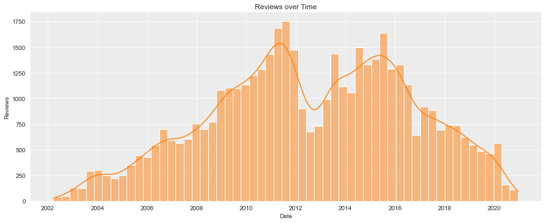
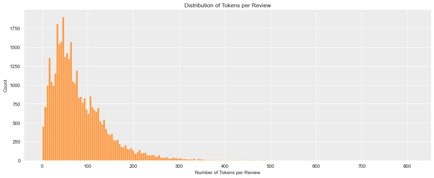

# Brewery Review Analysis with Natural Language Processing (NLP) and Named Entity Recognition (NER)


Springboard Data Science Career Track (_April 2020 Cohort_) - Final Capstone Project

* [🖼 Slides (PDF)](reports/Brewery%20Review%20NLP%20-%20Springboard%20Data%20Science%20-%20Final%20Capstone.pdf)
* [📹 Video Presentation (YouTube)](https://youtu.be/04svmI8TTOY)
* [📙 01. Data Wrangling notebook](notebooks/01%20-%20Data%20Wrangling.ipynb)
* [📙 02. Exploratory Data Analysis notebook](notebooks/02%20-%20Exploratory%20Data%20Analysis.ipynb)
* [📙 03. Model Training notebook](notebooks/03%20-%20Model%20Training.ipynb)
* [📙 04. Model Tuning & Evaluation notebook](notebooks/04%20-%20Model%20Tuning.ipynb)

## Problem Statement

It's useful for review collection companies such as Google Places, Yelp, and TripAdvisor to summarize reviews into short descriptive sentences or phrases. For example, from Google Maps, "From scratch, Northern Italian dining."

While these phrases could be manually created by humans it would be much more efficient to create these descriptions based on existing data, namely reviews.

Therefore, our main problem is:

**How can we generate short descriptions using review text?**

### Scope

Note that the scope of this project is limited to breweries, mainly to keep annotation simple since not all features generalize for all businesses or domains.

Additionally, this project's primary purpose is training and evaluating an NLP model using the Data Science Method (DSM). While the problem statement includes "generating short descriptions," context-free sentence generation is out of scope at this time.

#### Additional Context

Finally, beer and breweries are familiar domains for the researcherwho is the maintainer of the open-source project, [Open Brewery DB](https://www.openbrewerydb.org/).

### Problem Breakdown

The primary data science problem for this project is breaking down and summarizing text but **only highlighting words and phrases we value such as _brewery features, location, brewery names, and beer styles_**. We can then use these gathered phrases' linguistic information to construct a description of the reviewed business.

#### Manual Approach

A naive and extremely inefficient approach could be for a human to manually read through each brewery's reviews and develop a summarization sentence.

#### Rule-Based Approach

Another approach could be to use a rule-based system to search for and find select words we want to highlight. Reading through a dozen or so reviews (or investigating the word cloud above) and one can quickly pick out common "valuable" words such as "selection," "spacious," "IPA," and many more.

#### NER Trained Model Approach

However, even if we determine the word frequency of all brewery reviews, there are more words, tenses, pluralizations, and structures we might leave out. Not to mention accounting for the number of unique brewery names.

**In this project, we will use spaCy's ability to [train a statistical entity recognition model](https://spacy.io/usage/training) so we can creatively learn from a relatively small amount of samples.**

## Data Wrangling

[📙 Jupyter notebook](notebooks/01%20-%20Data%20Wrangling.ipynb)

While datasets are available from review sites, this project's scope revolves around breweries, bottle shops, brewpubs, and "craft beer" bars.

To ensure a clean dataset, we decided to scrape a publically available source, [Beer Advocate](https://www.beeradvocate.com).

### Source - Beer Advocate

For this project, we scraped the beer review website [Beer Advocate](https://www.beeradvocate.com) (BA).

Other public resources were considered, such as Yelp and Google Places, but none provided the necessary data. They also both had restrictions on what type of data you could pull via their API. A final prohibitive measure is that they are Javascripts apps, limiting scraping techniques, and increasing development time.

Beer Advocate is an older site and has a more basic HTML structure than most modern websites. However, it does allow for scraping a fair amount of publically available data.

While BA does provide more data for authenticated users, we will only be accessing publically available data in this project.

### Scraping Guidelines

This project followed a few guidelines not to overwhelm the BA website resources:

* Verified Terms of Use did not prohibit research projects
* Verified there was no available API to use
* Programmed a 1-second delay between requests
* Performed requests during off-hours
* Added a custom User-Agent in case the administrator needed to contact me
* Only scraped data needed

### Method

All of the data is stored in an SQLite3 database to handle the potentially long text.

The scraping script performs the following tasks:

1. Gather cities
2. For each city, gather breweries
3. For each brewery, gather reviews

#### DB Model Schema

The SQLite3 database used the following schema:

* **Cities**
  * id (Integer)
  * name (String)
  * url (String)
  * ba_city_id (Integer)
* **Breweries**
  * id (Integer)
  * name (String)
  * street (String)
  * city_id (Integer)
  * url (String)
  * ba_brewery_id (Integer)
* **Reviews**
  * id (Integer)
  * text (Text)
  * date (Datetime)
  * rating (Float)
  * ba_brewery_id (Integer)

### Results

* 86 cities
* 4,984 breweries
* 45,417 reviews

### Data Wrangling Lessons Learned

* It took ~5 hours to scrape ~5000 breweries. Each scrape took ~2 seconds with the delay. I completed the scrape between 12-14-2020 at 21:00 PST and 12-15-2020 at 04:00 PST.
* Using SQLite and SQLAlchemy was a good learning experience. A document-oriented database (document store), like MongoDB or AWS DynamoDB, would have served the same purpose and perhaps faster to implement.

## Exploratory Data Analysis

[📙 Jupyter notebook](notebooks/02%20-%20Exploratory%20Data%20Analysis.ipynb)

First, let's look at the number of reviews grouped by city:

<br>
_Figure 1 - Reviews per city_

As we can see with Figure 1, the top 5 cities in terms of brewery reviews are the following:

1. Portland, Oregon
2. Los Angeles, California
3. Minneapolis, California
4. San Diego, California
5. San Francisco, California

Now, let's take a look a the trend in the number of reviews over time:

<br>
_Figure 2 - Reviews over Time_

It seems there were peaks around 2011 and 2015 but has dropped off steeply since. This drop-in activity could be due to the advent of more mobile-friendly apps such as Untappd taking away from the market but would bear further investigation.

It's also interesting to see the steep decline in 2020, perhaps due to the COVID-19 pandemic and subsequent stay-at-home orders.

Along with the number of reviews, we can look at the average review ratings over time.

<br>
_Figure 3 - Number of Reviews per Rating_

Most ratings are between 3.8 and 4.4, with an average of around 4.0.

Finally, let's look at the distribution of sentences and tokens over the reviews:

<br>
_Figure 5 - Distribution of Sentences per Review_

<br>
_Figure 6 - Distribution of Tokens per Review_

Mostly this tells the story that most reviews are short while there is a long-tail of long-winded writers.

## Annotations (Data Wrangling Pt. 2)

While exploring the data in terms of qualitative values is interesting, we're more interested in linguistic information.

To train a spaCy language model to discover named entities, we need to provide some specific examples.  We achieve this through annotating brewery reviews.

The spaCy documentation recommends annotating a couple hundred to a couple of thousand examples for proper training.

**For this project, we annotated 200 reviews.**

### Named Entity Labels

We decided on the following named entity labels for annotation:

* **FEATURE** - Brewery feature including "spacious", "selection", "dog-friendly", "patio", etc.
* **LOCATION** - City or general location, including landmarks. "San Diego", "in downtown", "near Petco Park".
* **BEER_STYLE** - Beer style (Belgian, IPA), character (hoppy, hazy), or specific beer name (Speedway Stout)
* **BREWERY** - Any brewery name. "Half Door," "Alesmith," "Dogfish Head"

### Annotation Tool - Doccano

This project used the open-source tool Doccano to assist with annotating reviews. While the main goal was to provide annotated data to spaCy for NER model training, Doccano provided the following features:

* Easy-to-use highlighting and annotating interface
* Setting, importing and exporting NER labels
* Importing and exporting annotations via JSONL


### Annotation Lessons Learned

* Consistent and correct annotations are more critical than the number of annotations. The shorter the highlighted "chunk," the better.
* Examples without any annotations are just as useful.
* It required more thought than expected to select which words and group of words would work best.
* Individual sentences didn't provide enough context to be properly annotated. Additionally, a majority of the sentences weren't useful and was discouraging from an annotator's perspective.

## Model Training & Tuning

[📙 Jupyter notebook](notebooks/03%20-%20Model%20Training.ipynb)

Now that we have a couple of hundred annotated reviews, we can use Named Entity Recognition to mark words and phrases to collect and use them to construct descriptive sentences.

We will be using [spaCy](https://spacy.io/) and transfer learning to update the named entity recognizer model.

Once enough reviews have been annotated, we can train the model. But first, we need to convert the annotation into a format that spaCy can process.

### Convert Doccano JSONL to NER JSONL

JSONL is a file format where each line in the file is a JSON object.

Doccano exports annotation data in a JSONL labeled format like below:

```json
{"id": 1046, "text": "Solid selection of American and overseas stuff, but really no different than most of the shops in Portland. Not a huge store. Two guys working in the store seem to be decent guys, but one had an Ian Poulter -like attitude when I first started talking to him. His attitude seem improve the longer we talked. Overall a good experience and I would go back if in the area.", "meta": {}, "annotation_approver": null, "labels": [[0, 15, "FEATURE"], [19, 27, "BEER_STYLE"], [95, 106, "LOCATION"]]}
```

The expected NER data formatted as JSONL is based on the spaCy product, [Prodigy](https://prodi.gy/). It is converted to:

```json
{"entities": [{"start": 0, "end": 15, "label": "FEATURE"}, {"start": 19, "end": 27, "label": "BEER_STYLE"}, {"start": 95, "end": 106, "label": "LOCATION"}], "text": "Solid selection of American and overseas stuff, but really no different than most of the shops in Portland. Not a huge store. Two guys working in the store seem to be decent guys, but one had an Ian Poulter -like attitude when I first started talking to him. His attitude seem improve the longer we talked. Overall a good experience and I would go back if in the area."}
```

### Split Train and Test Data

After conversion to NER JSONL, we want to randomize the data and then split it into training data and testing data (or "dev data" in spaCy's vocabulary) to evaluate the trained model's accuracy.

It's easiest to do it at this step due to the amount of extra overhead the spaCy conversion creates, which will make it more computationally intensive if we do the train/test split afterward.

We use an 80/20 train/test split.

### Convert NER JSONL to spaCy JSON

Once the data is split, we transform the data we utilize the spaCy command `spacy convert` to convert the NER JSONL files to the spaCy-compatible JSON format.

The convert command looks similar to the following:

```bash
python -m spacy convert train-data.jsonl ./ --lang en
python -m spacy convert dev-data.jsonl ./ --lang en
```

### Transfer Learning

We can benefit from transfer learning by using exisiting `en_core_web_sm` and `en_core_web_md` models provided by spaCy.

While using these existing models increases the size and complexity of the final model, it also allows for the usage of the tagging and tokenization, which will help with parts-of-speech tokenization down the line when we generate our sentences.

## Evaluation & Final Model

[📙 Jupyter notebook](notebooks/04%20-%20Model%20Tuning.ipynb)

The `spacy train` command outputs the following useful statistics for evaluating NER training:

* **NER Loss** - Training loss for named entity recognizer. Should decrease, but usually not to 0.
* **NER P.** - NER precision on development data. Should increase.
* **NER R.** - NER recall on development data. Should increase.
* **NER F.** - NER F-score on development data. Should increase.

Finally, the following are the results of training blank and existing models with an 80/20 train/test split and 30 epochs.

|Metric | Blank Model | `en-core-web-sm` | `en-core-web-md`|
|---|---|---|---|
| Time | 0.16 s |0.46 s |0.56 s
| Words | 4226 |4226 |4226
| Words/s |27195 |9212 |7585
| NER P | 58.40 |62.76 | **62.94**
| NER R |47.71 |**59.48** | 58.82
| NER F |52.52 |**61.07** | 60.81

As shown in the table, the small model performs slightly better with recall and the F1 score, while the medium model performs marginally better with precision. Both do much better than the blank model.


### Final Model

Using transfer learning to resume training, the existing spaCy model `en-core-web-sm` provided decent results with 200 annotated examples. the final evaluation statistics were:

| Metric | Value |
| --- | --- |
| Time      | 0.46 s |
| Words     | 4226 |
| Words/s   | 9212 |
| NER P     | 62.76 |
| NER R     | 59.48 |
| NER F     | 61.07 |

## Conclusions

There is a lot more to do with this data and even more things to test. This means to scratch the surface and determine the best way to find "value" in a given review.

We have shown that we can train a statistical language model to highlight words and learn to pick out unseen accurate combinations during this research and analysis.

However, it does not seem that 200 annotations are enough to generalize across all brewery reviews accurately. As with most things related to neural networks, it will perform better with more examples.

It's also worth noting the value of consistent and accurate annotations to train the model. With enough examples, bad examples can be forgotten," but they can also cause some unforeseen and undesirable creative entity recognition. So, while lots of annotation samples are necessary, accurate samples are more desirable.

## Further Research

* It will be worthwhile to make multiple passes by annotating the reviews to gain the needed consistency.
* Using Mechanical Turk or another crowd-sourced service to annotate quickly is very interesting though it requires very thought-out and strict guidelines to reduce annotation approver's work.

## Project Organization

------------

    ├── LICENSE
    ├── README.md          <- The top-level README for developers using this project.
    ├── data
    │   ├── annotations    <- Annotation data used for training
    │   └── processed      <- The final, canonical data sets for modeling.
    │
    ├── docs               <- A default Sphinx project; see sphinx-doc.org for details
    │
    ├── models             <- Trained and serialized models, model predictions, or model summaries
    │
    ├── notebooks          <- Jupyter notebooks. Naming convention is a number (for ordering),
    │                         the creator's initials, and a short `-` delimited description, e.g.
    │                         `1.0-jqp-initial-data-exploration`.
    │
    ├── references         <- Data dictionaries, manuals, and all other explanatory materials.
    │
    ├── reports            <- Generated analysis as HTML, PDF, LaTeX, etc.
    │   └── figures        <- Generated graphics and figures to be used in reporting
    │
    ├── requirements.txt   <- The requirements file for reproducing the analysis environment, e.g.
    │                         generated with `pip freeze > requirements.txt`
    │
    ├── setup.py           <- makes project pip installable (pip install -e .) so src can be imported
    ├── src                <- Source code for use in this project.
    │   ├── __init__.py    <- Makes src a Python module
    │   │
    │   ├── data           <- Scripts to download or generate data
    │   │   └── make_dataset.py
    │   │
    │   ├── features       <- Scripts to turn raw data into features for modeling
    │   │   └── build_features.py
    │   │
    │   ├── models         <- Scripts to train models and then use trained models to make
    │   │   │                 predictions
    │   │   ├── predict_model.py
    │   │   └── train_model.py
    │   │
    │   └── visualization  <- Scripts to create exploratory and results-oriented visualizations
    │       └── visualize.py
    │
    └── tox.ini            <- tox file with settings for running tox; see tox.readthedocs.io

------------

This project is based on the [cookiecutter data science project template](https://drivendata.github.io/cookiecutter-data-science/). #cookiecutterdatascience
