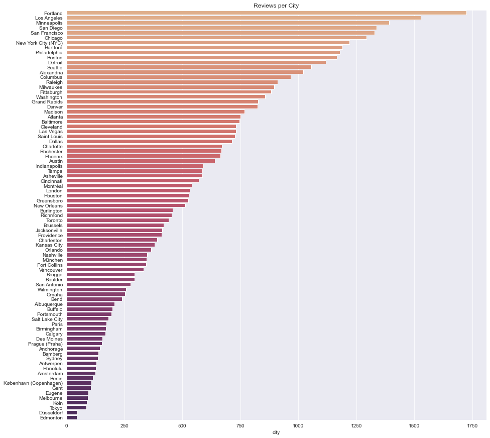
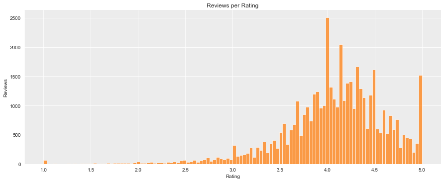

# Brewery Review NLP Project

## Final Capstone Project for Springboard Data Science Career Track - March 2020 Cohort

## Problem Statement

It's useful for review collection companies such as Google Places, Yelp, and TripAdvisor to summarize reviews into short descriptive sentences or phrases. For example, from Google Maps, "From scratch, Northern Italian dining."

**How can we generate short descriptions using reviews?**

### Scope

The scope of this project is limited to breweries, mainly to keep annotation simple. For example, while "hazy" is a desired feature for beer, it does not generalize for all businesses or domains.

Additionally, this project's primary purpose is training and evaluating an NLP model using the Data Science Method (DSM). While the problem statement includes "generating short descriptions," context-free sentence generation is out of scope.

#### Additional Context

Beer and breweries are familiar domains for the researcher who is the maintainer of the open-source project, [Open Brewery DB](https://www.openbrewerydb.org/).

### Problem Breakdown

The primary data science problem for this project is breaking down and summarizing text but **only highlighting words and phrases we value such as _brewery features, location, brewery names, and beer styles_**. We can then use the linguistic information of these gathered phrases to construct a description of the reviewed business.

#### Manual Approach

A naive and extremely inefficient approach could be for a human to manually read through each brewery's reviews and develop a summarization sentence.

#### Rule-Based Approach

Another approach could be to use a rule-based system to search for and find select words we want to highlight. Reading through a dozen or so reviews (or investigating the word cloud above) and one can quickly pick out common "valuable" words such as "selection," "spacious," "IPA," and many more.

#### NER Trained Model Approach

However, even if we determine the word frequency of all brewery reviews, there are more words, tenses, pluralizations, and structures we might leave out. Not to mention accounting for the number of unique brewery names.

**In this project, we will use spaCy's ability to [train a statistical entity recognition model](https://spacy.io/usage/training) so we can creatively learn from a relatively small amount of samples.**

## Data Wrangling ([notebook](notebooks/01 - Data Wrangling.ipynb))

While datasets are available from review sites, this project's scope revolves around breweries, bottle shops, brewpubs, and "craft beer" bars.

To ensure a clean dataset, we decided to scrape a publically available source, [Beer Advocate](https://www.beeradvocate.com).

### Source - Beer Advocate

For this project, we scraped the beer review website [Beer Advocate](https://www.beeradvocate.com) (BA).

Other public resources were considered, such as Yelp and Google Places, but neither provided the information required for this project. They also both had restrictions on what type of data you could pull via their API. A final prohibitive measure is that they are Javascripts apps, limiting scraping techniques, and increasing development time.

Beer Advocate is an older site and has a more basic HTML structure than most modern websites. However, it does allow for scraping a good amount of publically available data.

While BA does provide more data for authenticated users, we will only be accessing publically available data in this project.

### Scraping Guidelines

This project followed a few guidelines to not overwhelm the BA website resources:

* Verified Terms of Use did not prohibit research projects
* Verified there was no available API to use
* Programmed a 1-second delay between requests
* Performed requests during off-hours
* Added a custom User-Agent in case the administrator needed to contact me
* Only scraped data needed

### Method

All of the data is stored in an SQLite3 database to handle the potentially long text.

The scraping script performs the following tasks:

1. Gather cities
2. For each city, gather breweries
3. For each brewery, gather reviews

#### DB Model Schema

The SQLite3 database used the following schema:

* **Cities**
  * id (Integer)
  * name (String)
  * url (String)
  * ba_city_id (Integer)
* **Breweries**
  * id (Integer)
  * name (String)
  * street (String)
  * city_id (Integer)
  * url (String)
  * ba_brewery_id (Integer)
* **Reviews**
  * id (Integer)
  * text (Text)
  * date (Datetime)
  * rating (Float)
  * ba_brewery_id (Integer)

### Results

* 86 cities
* 4,984 breweries
* 45,417 reviews

### Data Wrangling Lessons Learned

* It took ~5 hours to scrape ~5000 breweries. Each scrape took ~2 seconds with the delay. I completed the scrape between 12-14-2020 at 21:00 PST and 12-15-2020 at 04:00 PST.
* Using SQLite and SQLAlchemy was a good learning experience. A document-oriented database (document store), like MongoDB or AWS DynamoDB, would have served the same purpose and perhaps faster to implement.

## Exploratory Data Analysis

First, let's look at the number of reviews grouped by city:

 
_Figure 1 - Reviews per city_

As we can see with Figure 1, the top 5 cities in terms of brewery reviews are the following:

1. Portland, Oregon
2. Los Angeles, California
3. Minneapolis, California
4. San Diego, California
5. San Francisco, California

Now, let's take a look a the trend in the number of reviews over time:

 
_Figure 2 - Reviews over Time_

It seems there were peaks around 2011 and 2015 but has dropped off steeply since. This drop in activity could be due to the advent of more mobile-friendly apps such as Untappd taking away from the market, but would take further investigation.

It's also interesting to see the steep decline in 2020, perhaps due to the COVID-19 pandemic and subsequent stay-at-home orders.

Along with the number of reviews, we can look at the average review ratings over time.

 
_Figure 3 - Number of Reviews per Rating_

Most ratings are between 3.8 and 4.4, with an average of around 4.0.

Finally, let's look at the distribution of sentences and tokens over the reviews:

 
_Figure 5 - Distribution of Sentences per Review_

 
_Figure 6 - Distribution of Tokens per Review_

Mostly this tells the story that most reviews are short while there is a long-tail of long-winded writers.

## Annotations

While exploring the data in terms of qualitative values is interesting, we're more interested in quantitative and linguistic information.

To train a language model to discover named entities, we need to provide some specific examples.  We achieve this through annotating brewery reviews.

The spaCy documentation recommends annotating a couple hundred to a couple of thousand examples for proper training.

For this project, we annotated 200 reviews with decent, though flawed, results.

### Named Entity Labels

We decided on the following named entity labels for annotation:

* FEATURE - Brewery feature including "spacious", "selection", "dog-friendly", "patio", etc.
* LOCATION - City or general location including landmarks. "San Diego", "in downtown", "near Petco Park".
* BEER_STYLE - Beer style (Belgian, IPA), character (hoppy, hazy), or specific beer name (Speedway Stout)
* BREWERY - Any brewery name

### Annotation Tool - Doccano

This project used the open-source tool Doccano to help annotate sentences. Doccano provided the following features:

* Easy-to-use highlighting and annotating interface
* Setting, importing, and exporting NER labels
* Importing and exporting annotations via JSONL

### Annotation Lessons Learned

* Consistent and correct annotations are more critical than the number of annotations.
* Examples without any annotations are just as useful.

## Model Training & Tuning

We can use Named Entity Recognition to mark words and phrases to collect and use them to construct descriptive sentences.

We will be using [spaCy](https://spacy.io/) and transfer learning to update the named entity recognizer model.

Once enough reviews have been annotated, we can train the model. But first, we need to convert the annotation into a format that spaCy can process.

After converting, we randomized and then split it into training data and testing (or dev) data to evaluate the trained model's accuracy. An 80/20 train/test split was determined to be the most favorable.

We transformed the data with a Python script and utilized the spaCy command-line interface (CLI) to convert the NER JSONL files to the spaCy-compatible JSON format.

### Transfer Learning

`en_core_web_sm` and `en_core_web_md`

### Model Training Lessons Learned

* We first started to annotate individual sentences only. After loading 500 individual sentences for annotation, we realized that the context might be more helpful from a user experience perspective and useful from a model training perspective.

## Evaluation

When evaluating, the `spacy train` command output the following statistics for NER training:

* **NER Loss** - Training loss for named entity recognizer. Should decrease, but usually not to 0.
* **NER P.** - NER precision on development data. Should increase.
* **NER R.** - NER recall on development data. Should increase.
* **NER F.** - NER F-score on development data. Should increase.

## Final model

* 200 annotation examples trained via transfer learning with `en_core_web_md` and 50 epochs.

## Conclusions

There is a lot more to do with this data and even more things to test. This means just to scratch the surface and determine the best way to find "value" in a given review.

## Further Research

* It will be worthwhile to make multiple passes by annotating the reviews to gain the needed consistency.
* Using Mechanical Turk or another crowd-sourced service to annotate quickly is very interesting though it requires very thought-out and strict guidelines to reduce annotation approver's work.

## Project Organization

------------

    ├── LICENSE
    ├── README.md          <- The top-level README for developers using this project.
    ├── data
    │   ├── annotations    <- Annotation data used for training
    │   └── processed      <- The final, canonical data sets for modeling.
    │
    ├── docs               <- A default Sphinx project; see sphinx-doc.org for details
    │
    ├── models             <- Trained and serialized models, model predictions, or model summaries
    │
    ├── notebooks          <- Jupyter notebooks. Naming convention is a number (for ordering),
    │                         the creator's initials, and a short `-` delimited description, e.g.
    │                         `1.0-jqp-initial-data-exploration`.
    │
    ├── references         <- Data dictionaries, manuals, and all other explanatory materials.
    │
    ├── reports            <- Generated analysis as HTML, PDF, LaTeX, etc.
    │   └── figures        <- Generated graphics and figures to be used in reporting
    │
    ├── requirements.txt   <- The requirements file for reproducing the analysis environment, e.g.
    │                         generated with `pip freeze > requirements.txt`
    │
    ├── setup.py           <- makes project pip installable (pip install -e .) so src can be imported
    ├── src                <- Source code for use in this project.
    │   ├── __init__.py    <- Makes src a Python module
    │   │
    │   ├── data           <- Scripts to download or generate data
    │   │   └── make_dataset.py
    │   │
    │   ├── features       <- Scripts to turn raw data into features for modeling
    │   │   └── build_features.py
    │   │
    │   ├── models         <- Scripts to train models and then use trained models to make
    │   │   │                 predictions
    │   │   ├── predict_model.py
    │   │   └── train_model.py
    │   │
    │   └── visualization  <- Scripts to create exploratory and results-oriented visualizations
    │       └── visualize.py
    │
    └── tox.ini            <- tox file with settings for running tox; see tox.readthedocs.io

------------

This project is based on the [cookiecutter data science project template](https://drivendata.github.io/cookiecutter-data-science/). #cookiecutterdatascience
